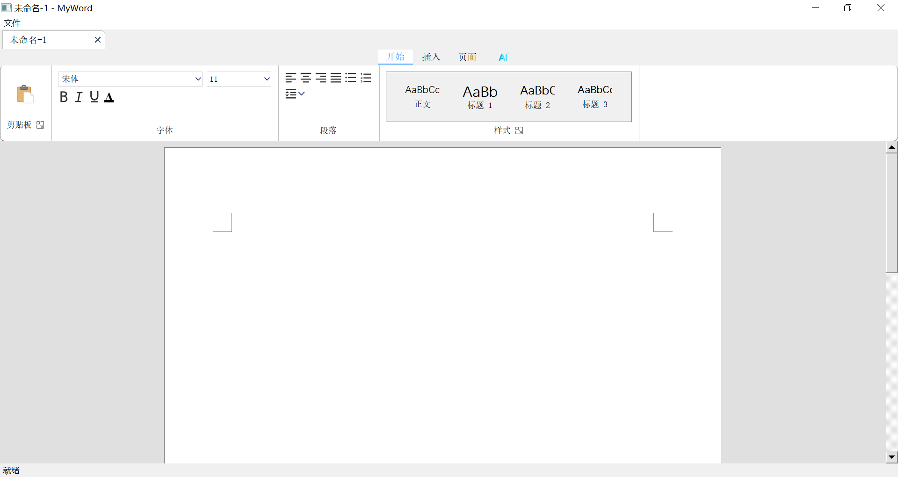
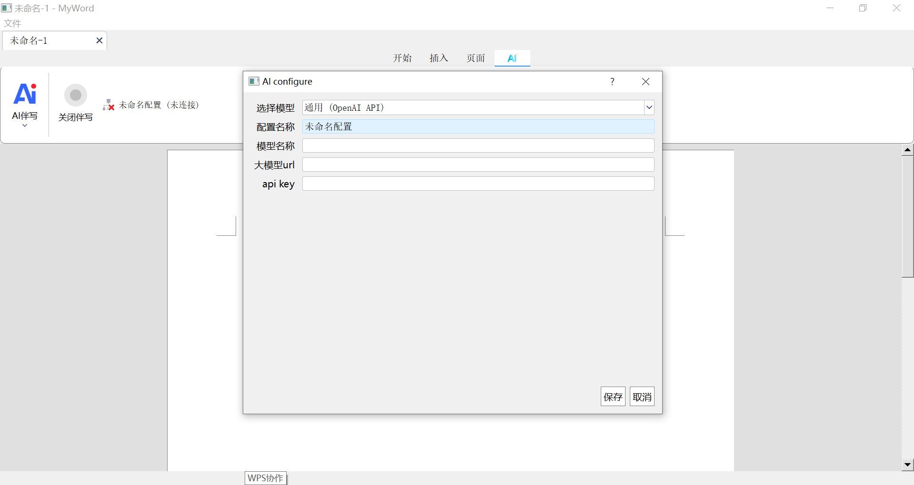

# Rich text with AI helper

To obtain a deeper understanding of Qt, I developed this project, a simple rich editor, which requires the ability of building a large C++ project (includes the network programming, internationalization) with cmake and visual studio 2019. And also, I compiled the `topmenu` into a dynamic library and the `editor` into a static library. Here is what the interface looks like.

Yes, I referred to MS Word to implement it. So it looks like I'm using a real Word, despite many features have not yet fully developed.

## 1 How To Build

- You should prepare the `thirdparty_install` which contains the necessary development tools. And I've uploaded it and you just need unzip it.
- ⭐⭐In `build.bat`, you need replace the path of `vcvarsamd64_x86.bat` with your own path.
- After executing `build.bat`, all debug files are generated in `build\` (it will create a new as `build` does not exist).

> [!caution]
>
> Each part generates an independent translation file (`*.ts` in `project\mui\zh_CN\`). When you release your project, you need to copy the `*.qm` into the corresponding source file `*.qrc` manually. So that you can access `*.qm` in `main.cpp` correctly.

## 2 Basic Functions

- The packaged program is in `boxed\`. You can directly execute it in Windows system.
- **Pagination management** is too hard to implement. You must re-write the mouse event and keyboard event to define your own text editor instead of using `QTextEdit` or something else. The original text components **cannot** automatically break pages like Word does. This is a tremendous undertaking!
- **Multi-documents management** gives rise to lagging programs. (This is the stupid requirement!)
- Save and load documents without parsing.

## 3 AI Helps You to Write

- You can choose the general model and fill in the information as you do in python `openai.ChatCompletion.create`. However, I'm not sure whether it can connect to the llm successfully for the unknown JSON request format (maybe I didn't find it).
- Or you can also select the "self-define", execute the local llm and fill in the custom JSON format. For instance, `ai_server.py` applies `FastAPI` to connect with the Qt with agreed JSON format.
- You can see the rough ghost text prompt following your editing words as you open AI service.

## 4 Conclusion

Within a week, I finished this project with the help of Gemini Pro. The Qt native components are so ugly, so I have to redefine them all to make it look well. Finally, there is no need to refine this text editor for its uselessness. It's just a learning project: how to build a large C++ project (not only Qt).